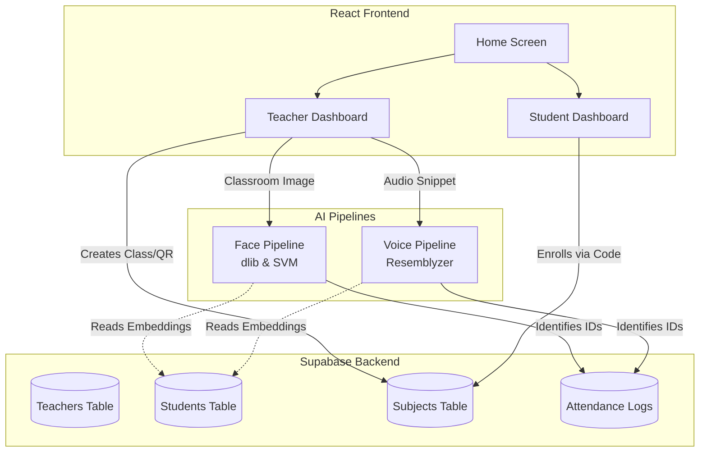

<p align="center">
  
</p>

<h1 align="center">SayCheese.ai: AI-Powered Attendance Management for College </h1>

<p align="center">
  <a href="https://react.dev/"></a>
  <a href="https://www.python.org/"></a>
  <a href="https://supabase.com/"></a>
  <a href="#"></a>
</p>

## 📌 Overview

**SayCheese.ai** is a modern, fast, and highly secure web application built with React and Python that revolutionizes how educational institutions track attendance. By utilizing advanced machine learning pipelines—including both **Facial Recognition** and **Voice Biometrics**—SayCheese.ai eliminates manual roll-calls and buddy punching, providing a seamless experience for both teachers and students.

---

## ✨ Key Features

### 👨‍🏫 For Teachers
- **Create & Manage Subjects:** Easily set up subjects and sections.
- **AI-Powered Attendance:**
  - **📸 Face Recognition:** Capture the classroom and automatically identify present students.
  - **🗣️ Voice Recognition:** Mark attendance seamlessly via student voice recordings.
- **Generate QR Codes:** Instantly create QR codes for students to enroll in classes.
- **View Insights:** See detailed attendance logs and track student enrollment.

### 👨‍🎓 For Students
- **Simple Enrollment:** Join a subject instantly using a unique join code or by scanning a QR Code.
- **Track Progress:** View attendance records for all enrolled subjects.
- **Biometric Profiles:** Register Face and Voice embeddings securely for automated check-ins.

---

## 🏗 Architecture & Flow

<p align="center">
  
</p>

### System Architecture

The core of SayCheese.ai operates on an efficient ML pipeline backed by a scalable Supabase database.



---

## 🛠 Tech Stack

- **Frontend:** React, Vite, React Bootstrap
- **Backend/Database:** Python, Supabase, bcrypt (Auth)
- **Machine Learning Pipelines:**
  - `dlib` & `face_recognition_models`: High-accuracy face detection and 128D encodings.
  - `scikit-learn` (SVC): Linear SVM classifier for fast facial matching.
  - `resemblyzer` & `librosa`: Deep learning based voice embedding extraction and audio processing.
- **Utilities:** `numpy`, `pandas`, `segno` (QR code generation), `pillow`

---

## 🚀 Getting Started

Follow these steps to set up the project locally. The project is split into independent `frontend` and `backend` directories.

### 1. Clone the repository
```bash
git clone https://github.com/yourusername/SayCheese.ai-app.git
cd SayCheese.ai-app
```

### 2. Frontend Setup (React/Vite)
Navigate to the frontend directory and start the development server:

```bash
cd frontend
npm install
npm run dev
```

### 3. Backend Setup (Python)
Navigate to the backend directory and set up the virtual environment:

```bash
cd backend
python -m venv venv

# On Windows:
venv\Scripts\activate

# On Mac/Linux:
source venv/bin/activate
```

Install backend dependencies (make sure you have CMake installed for `dlib`):

```bash
pip install -r requirements.txt
```

### 4. Setup Environment Variables
Create an environment variables file in the backend directory and add your Supabase credentials:

```toml
[supabase]
url = "YOUR_SUPABASE_PROJECT_URL"
key = "YOUR_SUPABASE_ANON_KEY"
```

### 5. Run the Backend Application
```bash
# Start your Python backend server
python app.py
```

<p align="center">
  
</p>
